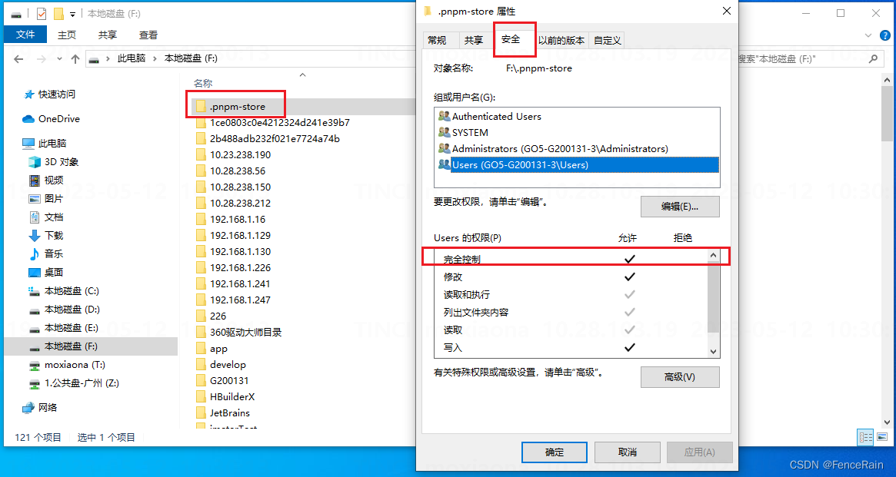

## Enhance Productivity

### Environment

```js
node@20.12.2
npm@10.5.0
pnpm@9.15.0
```

### Build Issues:

```js
 ERR_PNPM_EPERM  EPERM: operation not permitted, stat 'D:\.pnpm-store\v3\files\26\ebaec88d551a095705aa1aa150b5415da4609e929714f0b45ab05a9206dfc449dbe46d6df491998844af1d232325da23201d3bc29e85131dc588761fd348d5'

 文件夹.pnpm-store，右键——属性——安全——选中当前电脑用户——编辑——勾选完整控制——确定
```


